# AUTO-RMF: Automated Risk Management Framework Compliance

**Continuous compliance monitoring and automated evidence collection for AWS multi-account environments implementing NIST 800-53 Rev 5 controls.**

---

## The Problem

Traditional RMF requires ISSOs to manually screenshot 300+ controls every assessment cycle. Compliance becomes a quarterly burden instead of continuous validation. Point-in-time assessments with zero visibility between cycles.

---

## The Solution

Infrastructure-as-code platform that continuously monitors compliance and auto-generates audit-ready evidence.

**What it does:**
- 4-account AWS Organizations structure with delegated security administration
- 23 NIST 800-53 controls as Config rules evaluating on every configuration change
- Security Hub + GuardDuty + Config findings aggregated to centralized dashboards
- Lambda collects compliance evidence daily → exports timestamped JSON to S3

**Impact:**
- **Weeks of manual evidence collection** → Single Lambda invocation
- **Point-in-time snapshots** → Real-time continuous monitoring
- **Screenshot spreadsheets** → Automated audit-ready JSON organized by control family

---

## Architecture

**Control Plane:**
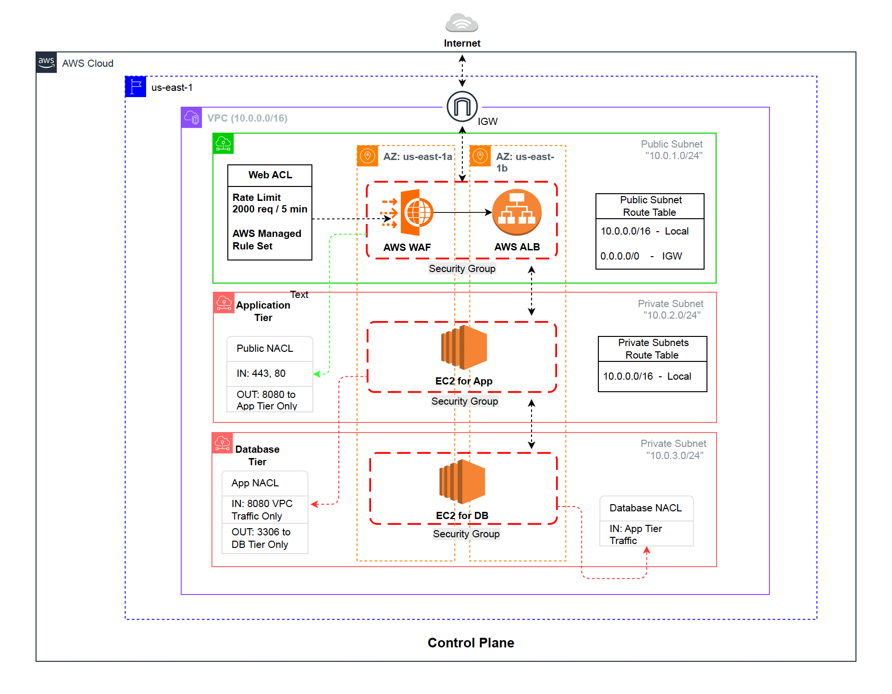

4-account structure (Management, Logging, Security, Workload) with delegated security administration. CloudTrail organizational trail, SCPs, centralized S3 logging.

**Data Plane:**
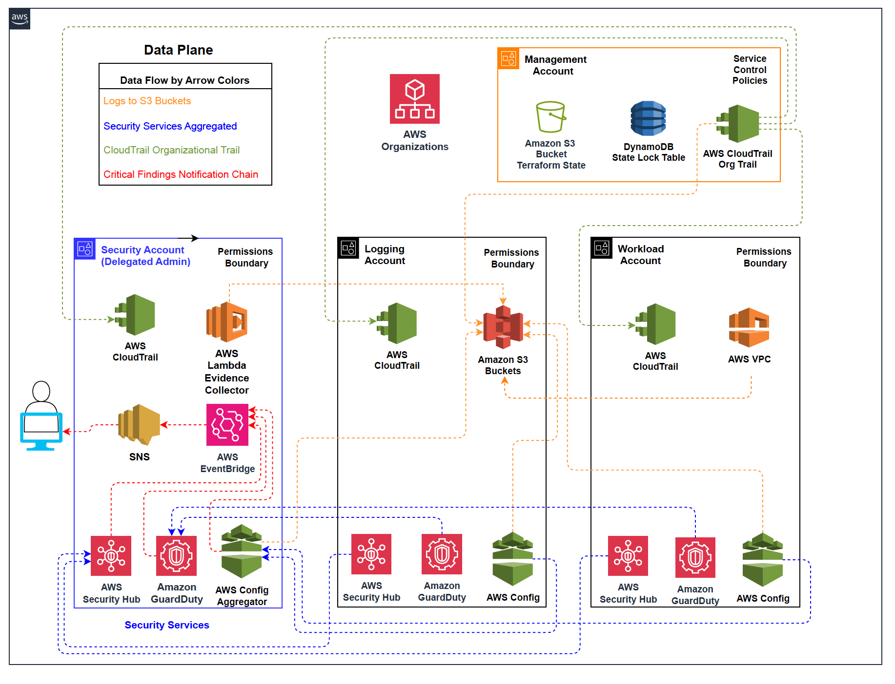

Cross-account security aggregation. Security Hub findings + GuardDuty detections + Config compliance → Security account. EventBridge triggers Lambda evidence collector → Logging account S3.

---

## Compliance Evidence: The Story

**Follow the screenshots in sequence to see the compliance automation lifecycle:**

### 1. Infrastructure Deployment
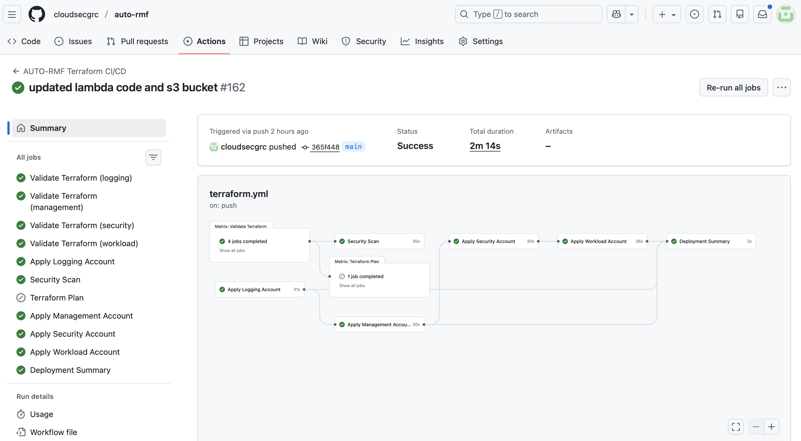

GitHub Actions deploys all 4 accounts via Terraform with OIDC authentication. Matrix strategy, parallel deployment, zero long-lived credentials.

### 2. Multi-Account Aggregation
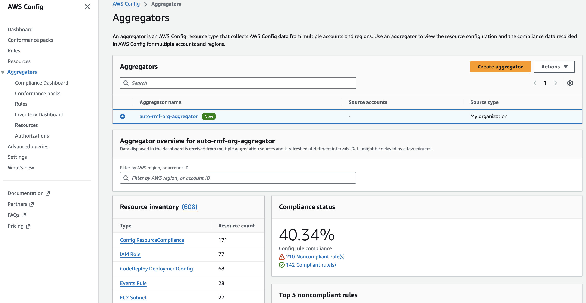 | 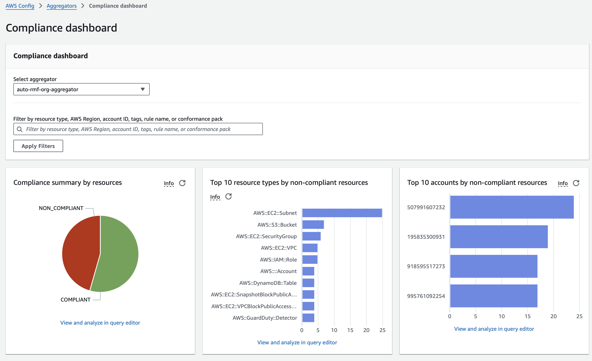

Config aggregator provides single pane of glass across 608 resources in 4 accounts. Workload account shows highest violations - proving detection works.

### 3. Baseline Compliance Posture
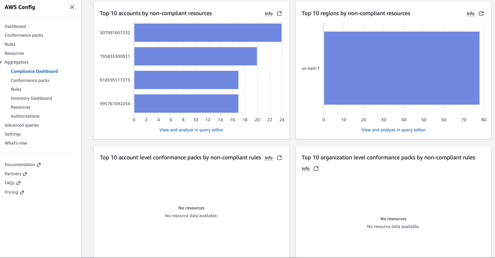

Starting point: 40.34% compliant, 210 noncompliant rules. Real compliance posture, not sanitized demo.

### 4. Security Control Violations Detected

**AC-17 (Remote Access):** 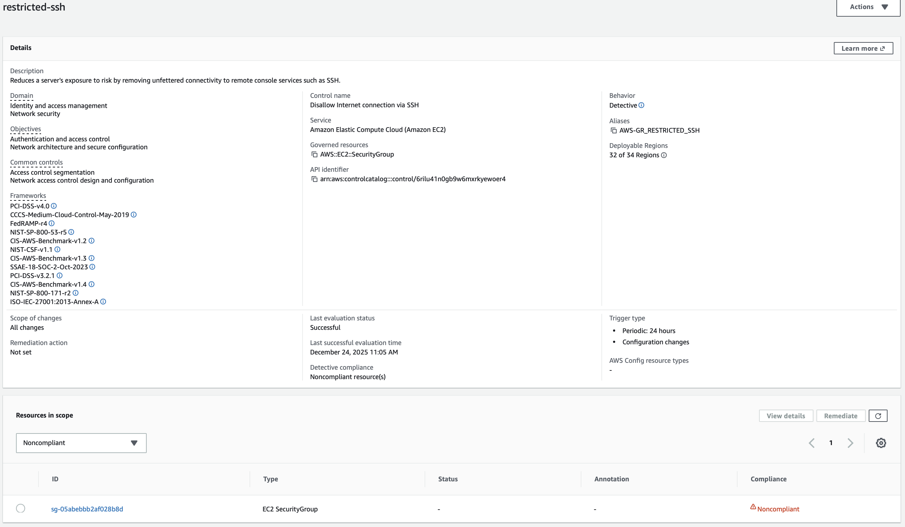 Security group allowing SSH from 0.0.0.0/0

**AC-6 (Least Privilege):** 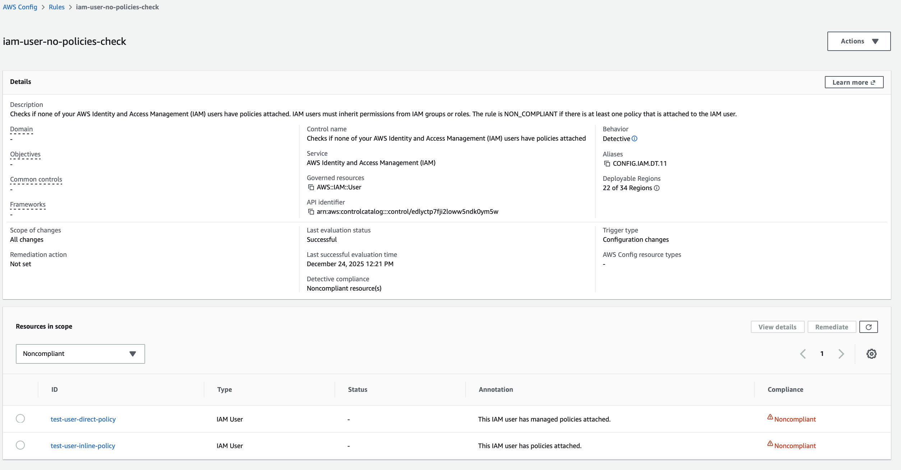 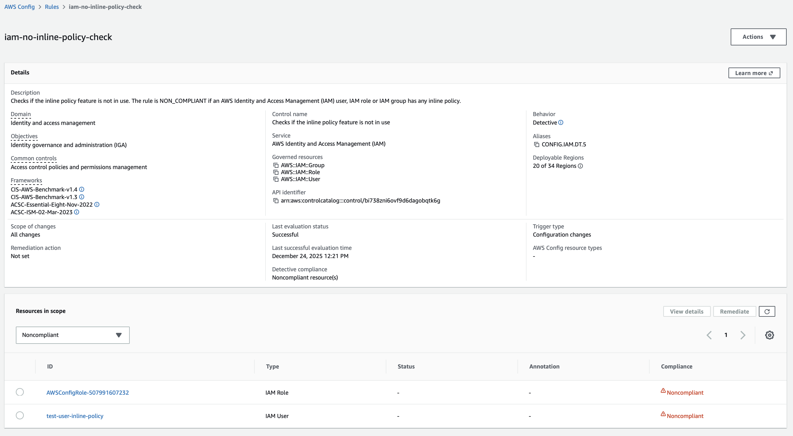 IAM users with direct/inline policy attachments

**IA-2 (Authentication):** 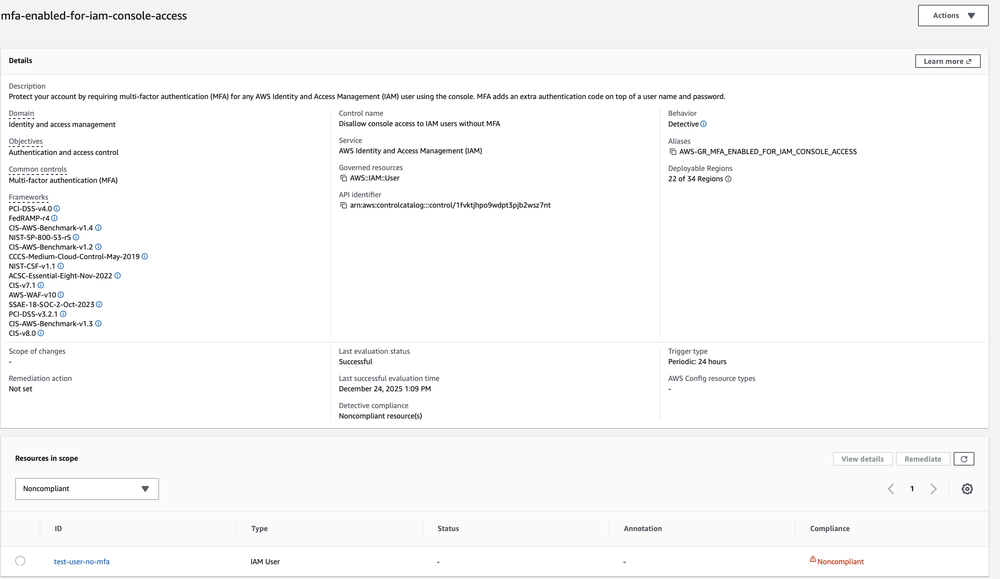 Console user without MFA enabled

**SC-13 (Cryptographic Protection):** 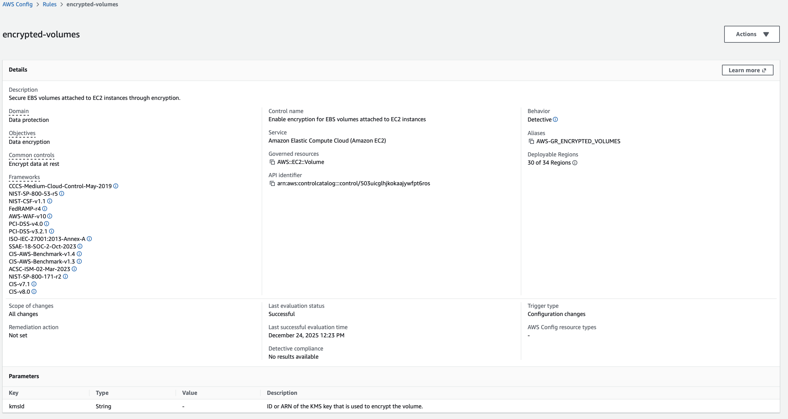 Unencrypted EBS volume

### 5. Automated Evidence Collection
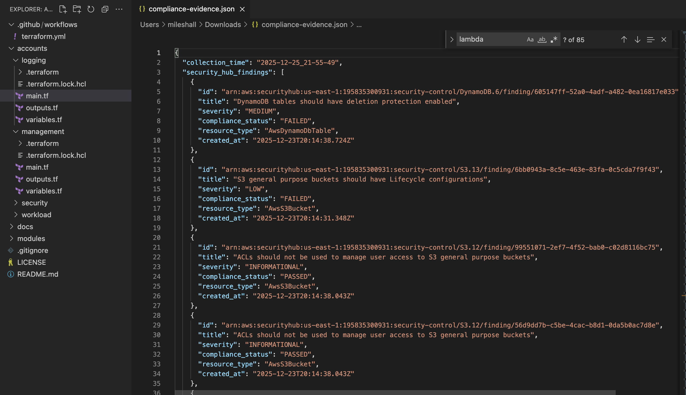

Lambda exports Security Hub findings, GuardDuty detections, Config compliance to timestamped JSON. Audit-ready evidence for continuous monitoring narrative.

**Full control mapping:** [docs/CTM.csv](docs/CTM.csv)

---

## Tech Stack

**Infrastructure:** Terraform, AWS Organizations, GitHub Actions (OIDC)

**Compliance Monitoring:** Security Hub (CENTRAL config), GuardDuty, AWS Config (23 rules), CloudTrail

**Evidence Collection:** Lambda (Python 3.11), EventBridge, S3 (encrypted, versioned)

**Networking:** VPC, Security Groups, NACLs, VPC Flow Logs (architecture diagram shows ALB, WAF, and EC2 instances for visualization - deployed code focuses on security control infrastructure)

**Security:** KMS envelope encryption, IAM permission boundaries, Service Control Policies

---

## Why I Built This

**Background:**
10 years in DoD (soldier → civilian → contractor). Currently ISSO in cleared space while finishing Master's in Cyber Operations.

**The Evolution:**
Traditional ISSO work is dying. We're either becoming "GRC Engineers" who automate compliance, or we're getting replaced by the engineers who figure it out first.

**The DoD Reality:**
Cloud is mandatory (DoD Cloud Strategy), but RMF processes haven't caught up. Organizations are stuck doing quarterly manual assessments on infrastructure that changes every commit. Continuous monitoring isn't optional anymore - it's the only way to maintain ATO in environments where infrastructure-as-code deploys changes daily.

**This project demonstrates the fix:** Infrastructure that monitors configuration changes in real-time, evaluates compliance continuously against NIST 800-53 controls, and generates evidence automatically. Replace quarterly assessment cycles with continuous validation that actually reflects current security posture.

---

## Contact

**Miles Hall**  
LinkedIn: [linkedin.com/in/milestylerhall](https://www.linkedin.com/in/milestylerhall)  
GitHub: [github.com/cloudsecgrc](https://github.com/cloudsecgrc)

---

**License:** MIT | **Last Updated:** December 2025

